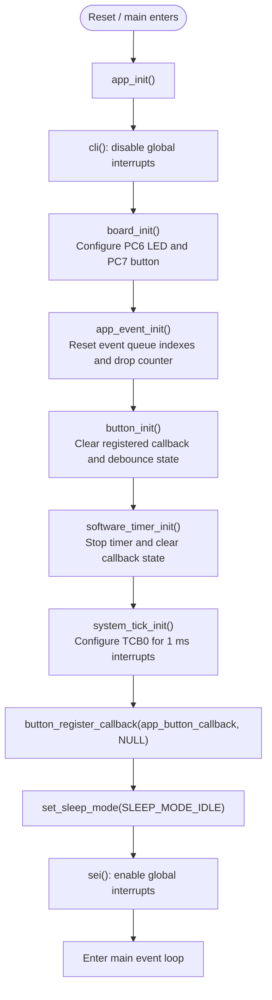
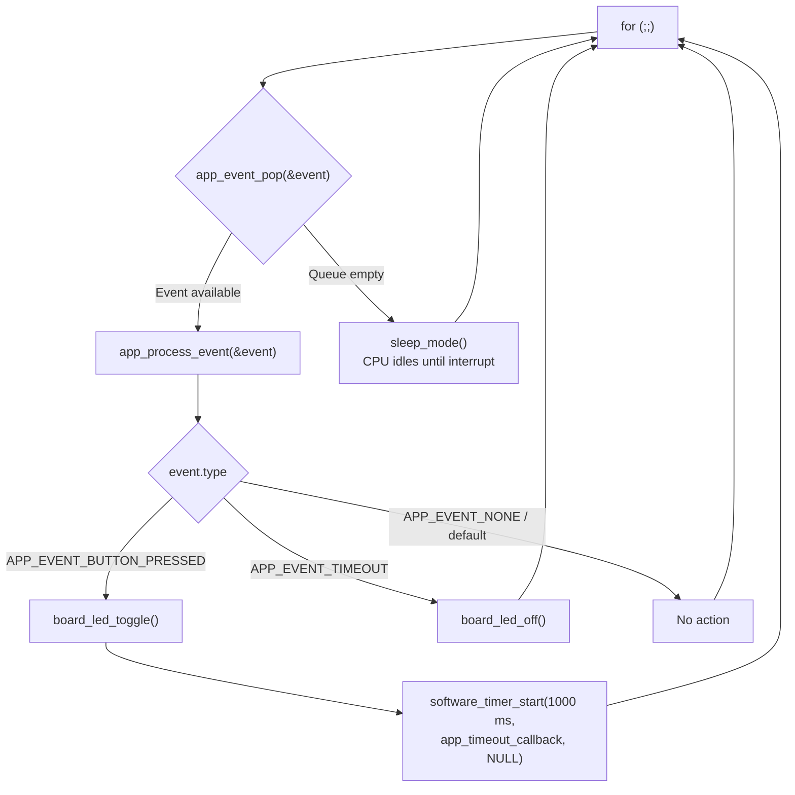
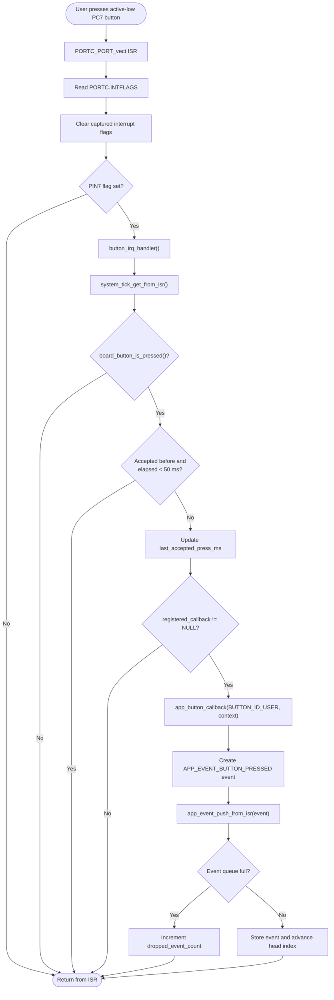
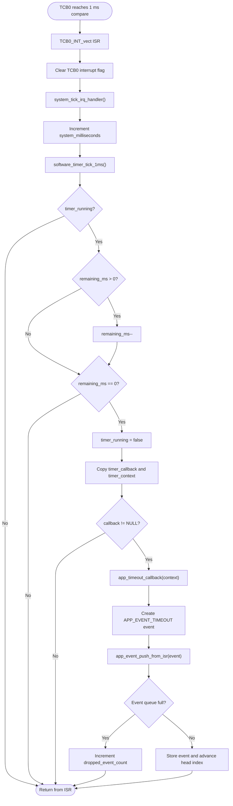
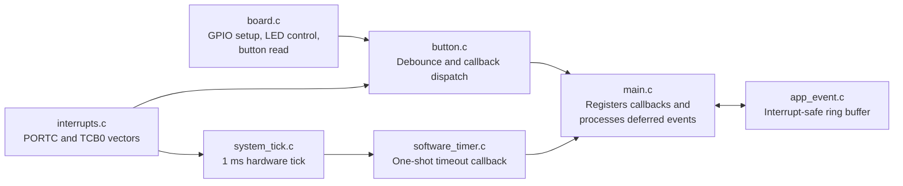

# Project Flowchart

This document describes the runtime flow for the AVR128DA48 callback and
event-driven demonstration.

## System Initialization

## Main Event Loop

## Button Press Event Path

## Timer Timeout Event Path

## Module Responsibilities

