# SPI Driver — Flowcharts

**Target:** AVR128DA48 Curiosity Nano  
**Driver files:** `spi_driver.h` / `spi_driver.c`  
**Toolchain:** Atmel / Microchip Studio 7 — GCC C Executable Project  

---

## Table of Contents

1. [System-Level Overview](#1-system-level-overview)
2. [SPI_Init](#2-spi_init)
3. [SPI_Deinit](#3-spi_deinit)
4. [Chip-Select Helpers — SPI_CS_Low / SPI_CS_High](#4-chip-select-helpers)
5. [Blocking Transfer — SPI_TransferByte](#5-blocking-transfer--spi_transferbyte)
6. [Blocking Transfer — SPI_TransferBuffer](#6-blocking-transfer--spi_transferbuffer)
7. [Non-Blocking Transfer — SPI_StartTransfer](#7-non-blocking-transfer--spi_starttransfer)
8. [Non-Blocking Query — SPI_TransferComplete](#8-non-blocking-query--spi_transfercomplete)
9. [Non-Blocking Read — SPI_ReadNonBlocking](#9-non-blocking-read--spi_readnonblocking)
10. [ISR — SPI0_INT_vect (Transfer-Complete Interrupt)](#10-isr--spi0_int_vect)
11. [Ring Buffer Operations](#11-ring-buffer-operations)
12. [Diagnostics — SPI_GetTimeoutCount / SPI_ClearTimeoutCount](#12-diagnostics)
13. [Complete Non-Blocking Call Sequence (Caller + Driver + ISR)](#13-complete-non-blocking-call-sequence)

---

## 1. System-Level Overview

High-level picture of the two transfer modes and how they relate to the
hardware, the ISR, and the application layer.

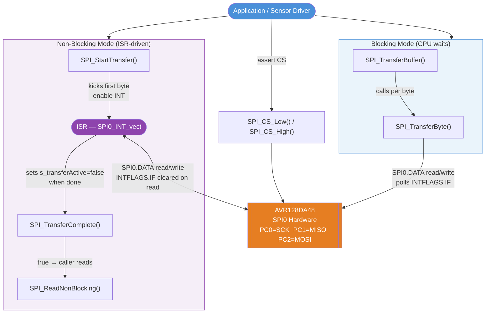

---

## 2. SPI_Init

Configures PORTC pin directions, writes `SPI0.CTRLB` (mode + SSD),
writes `SPI0.CTRLA` (master + prescaler + CLK2X + enable), then
resets all driver state variables.

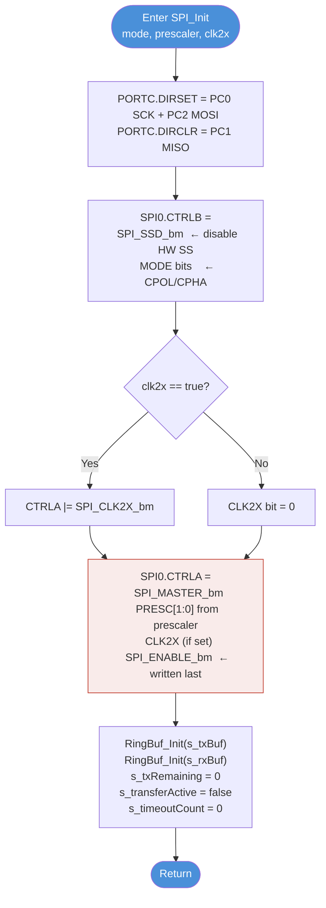

---

## 3. SPI_Deinit

Safe shutdown sequence — interrupt disabled before ENABLE cleared to
prevent a spurious ISR fire at the end of a transfer.

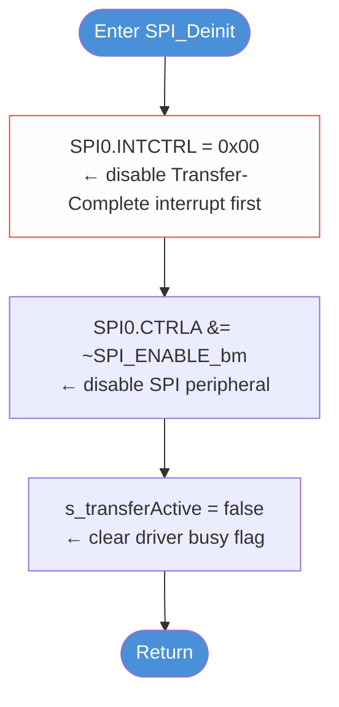

---

## 4. Chip-Select Helpers

`SPI_CS_Low` and `SPI_CS_High` are thin wrappers around atomic
PORT register writes.  Both follow the same shape.

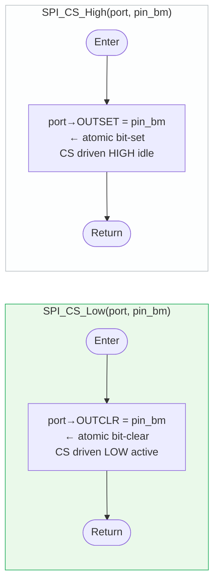

> **Why OUTCLR / OUTSET instead of OUT?**  
> These registers perform a single atomic write to one bit without a
> read-modify-write cycle, eliminating the race condition that would occur
> if an ISR modified another pin on the same port between the read and write.

---

## 5. Blocking Transfer — SPI_TransferByte

The fundamental blocking primitive.  Every blocking call in the driver
ultimately passes through here.

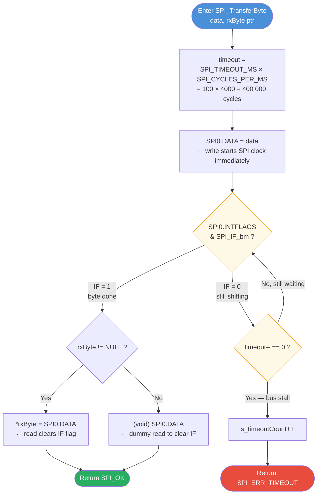

---

## 6. Blocking Transfer — SPI_TransferBuffer

Iterates over a byte array, calling `SPI_TransferByte` for each element.
Either TX or RX buffer (but not both) may be `NULL`.

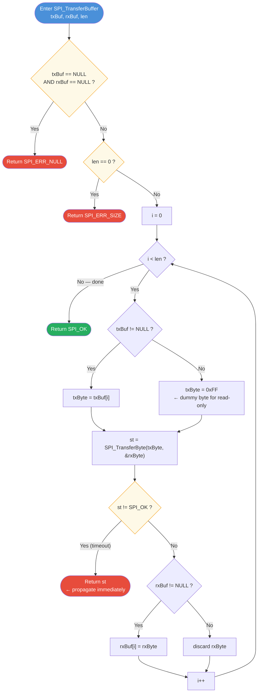

---

## 7. Non-Blocking Transfer — SPI_StartTransfer

Validates arguments, loads the TX ring buffer, arms state variables,
writes the first byte to hardware, then enables the ISR and returns
immediately to the caller.

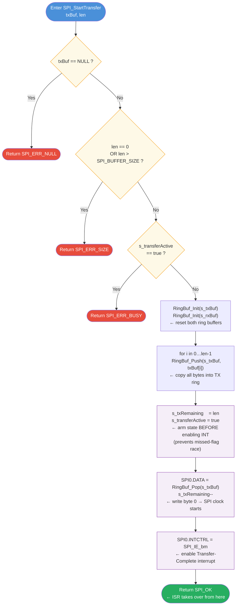

---

## 8. Non-Blocking Query — SPI_TransferComplete

A single-expression poll of the `s_transferActive` flag set/cleared by
the ISR.  No side-effects.

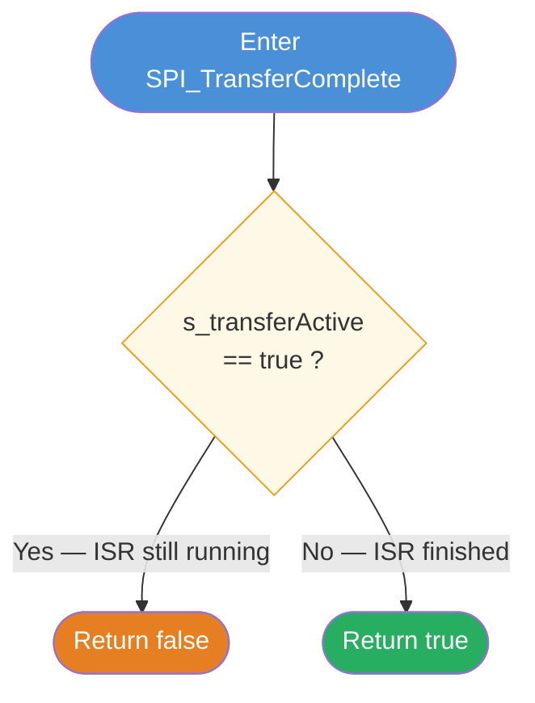

---

## 9. Non-Blocking Read — SPI_ReadNonBlocking

Drains the internal RX ring buffer into the caller's buffer after
`SPI_TransferComplete()` has returned `true`.

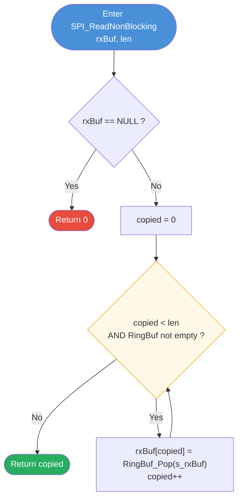

---

## 10. ISR — SPI0_INT_vect

Fires automatically after each byte exchange.  Keeps its own logic minimal
to stay within the inter-byte deadline.

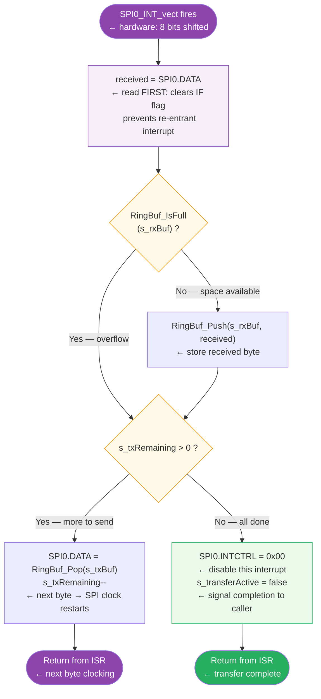

> **Critical ordering:** `SPI0.DATA` must be read **before** any other
> register access.  Reading DATA clears the `INTFLAGS.IF` bit, which
> prevents a spurious re-entry on some AVR-Dx silicon revisions.

---

## 11. Ring Buffer Operations

All four operations share the same `head`/`tail` index scheme with
bitmask wrap-around (`index & SPI_BUF_MASK`).

```mermaid
flowchart TD
    subgraph INIT_RB ["RingBuf_Init(rb)"]
        I1([Enter]) --> I2["rb→head = 0\nrb→tail = 0"]
        I2 --> I3([Return])
    end

    subgraph EMPTY ["RingBuf_IsEmpty(rb)"]
        EM1([Enter]) --> EM2{"head == tail ?"}
        EM2 -->|Yes| EM3(["Return true"])
        EM2 -->|No| EM4(["Return false"])
    end

    subgraph FULL_RB ["RingBuf_IsFull(rb)"]
        F1([Enter]) --> F2{"(head+1) & MASK\n== tail ?"}
        F2 -->|Yes| F3(["Return true"])
        F2 -->|No| F4(["Return false"])
    end

    subgraph POP_RB ["RingBuf_Pop(rb)"]
        P1([Enter]) --> P2["byte = buf[tail]"]
        P2 --> P3["tail = (tail+1) & MASK"]
        P3 --> P4(["Return byte"])
    end

    subgraph PUSH_RB ["RingBuf_Push(rb, byte)"]
        PU1([Enter]) --> PU2["buf[head] = byte"]
        PU2 --> PU3["head = (head+1) & MASK"]
        PU3 --> PU4([Return])
    end

    style INIT_RB  fill:#EAF4FB,stroke:#4A90D9
    style EMPTY    fill:#EAF9EA,stroke:#27AE60
    style FULL_RB  fill:#FDFEFE,stroke:#BDC3C7
    style POP_RB   fill:#FEF9E7,stroke:#F39C12
    style PUSH_RB  fill:#F5EEF8,stroke:#8E44AD
```

**Buffer state diagram:**

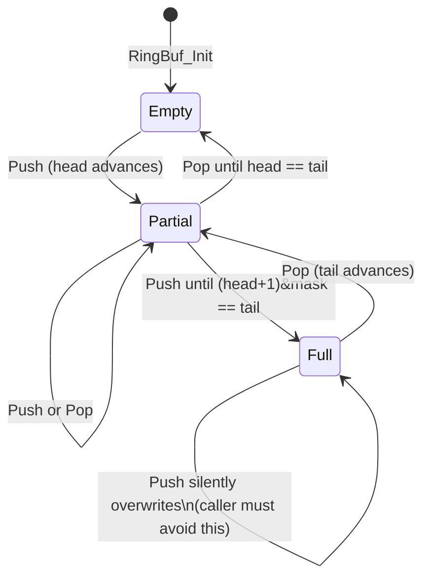

---

## 12. Diagnostics

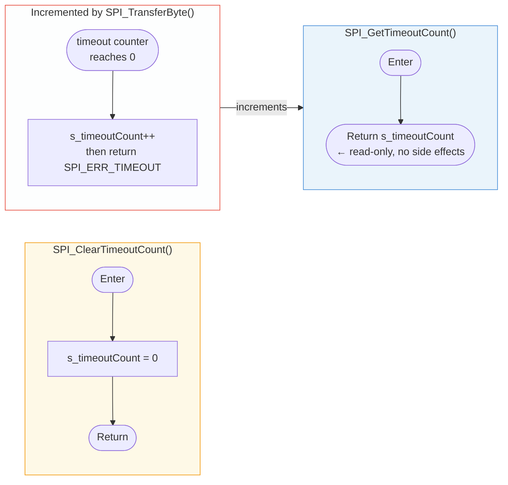

---

## 13. Complete Non-Blocking Call Sequence

End-to-end sequence showing the interplay between the **caller** (application
or sensor driver), the **SPI driver API**, and the **hardware ISR**.
This is the flow demonstrated by `demo_non_blocking()` in `main.c`.

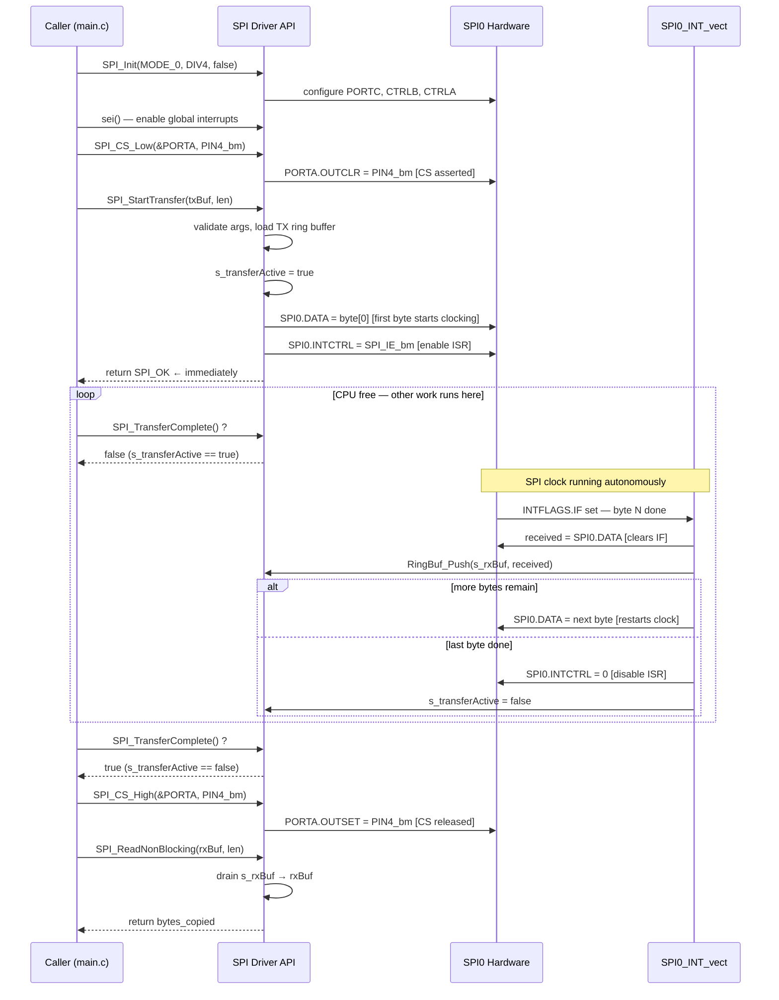

---

*Generated for AVR128DA48 — AVR-Dx Device Pack 2.4.286*
