# System Flowcharts

This document contains Mermaid diagrams that describe the runtime behaviour of the PWM-Controlled Power Module firmware. GitHub renders Mermaid natively inside Markdown code fences tagged ` ```mermaid `.

---

## Table of Contents

1. [System Initialisation Sequence](#1-system-initialisation-sequence)
2. [Super-Loop (Main Loop)](#2-super-loop-main-loop)
3. [Cooperative Scheduler](#3-cooperative-scheduler)
4. [Control-Loop State Machine](#4-control-loop-state-machine)
5. [ADC Driver — Interrupt Flow](#5-adc-driver--interrupt-flow)
6. [USART Driver — Interrupt Flow](#6-usart-driver--interrupt-flow)
7. [AC Driver — Interrupt Flow](#7-ac-driver--interrupt-flow)
8. [EVSYS Autonomous Event Path](#8-evsys-autonomous-event-path)
9. [FIFO Ring Buffer — Put and Get](#9-fifo-ring-buffer--put-and-get)
10. [Task Timing Diagram](#10-task-timing-diagram)
11. [Full Peripheral Interaction Map](#11-full-peripheral-interaction-map)

---

## 1. System Initialisation Sequence

```mermaid
flowchart TD
    RESET([Power-On / Reset]) --> CLK

    CLK["Configure CPU clock
    CCP write to OSCHF at 24 MHz
    Wait for SOSC flag to clear"]
    CLK --> LED_INIT

    LED_INIT["Configure LED pin
    PC6 output, drive HIGH
    active-low LED off"]
    LED_INIT --> USART_INIT

    USART_INIT["USART_Init()
    PORTMUX to PA0/PA1
    PA0 output TXD
    Set BAUD register
    Enable TX and RX
    Enable RXCIE interrupt
    Init RX FIFO"]
    USART_INIT --> ADC_INIT

    ADC_INIT["ADC_Init()
    PD2 input-disable analogue
    VREF.ADC0REF = 2.048 V
    ADC0 12-bit DIV16 prescaler
    MUXPOS = AIN2
    Enable STARTEI event trigger
    Enable RESRDY interrupt"]
    ADC_INIT --> AC_INIT

    AC_INIT["AC_Init()
    VREF.ACREF = VDD
    AC0 MUXCTRL AINP0 / DACREF
    AC0 DACREF = 128, 50% VDD
    INTCTRL BOTHEDGE interrupt
    CTRLA small hysteresis enable"]
    AC_INIT --> TCA_INIT

    TCA_INIT["TCA_Init()
    PORTMUX TCA0 to PORTD
    PD0 output
    TCA0 SINGLE mode
    SINGLESLOPE PWM CMP0EN
    PER = 1023, CMP0 = 0
    CTRLA DIV1 ENABLE"]
    TCA_INIT --> EVSYS_INIT

    EVSYS_INIT["EVSYS_Init()
    CHANNEL0 = AC0_OUT
    USERADC0START = CH0 0x01"]
    EVSYS_INIT --> SCHED_INIT

    SCHED_INIT["SCHED_Init()
    Clear task table
    RTC.CLKSEL = OSC32K
    RTC.PITCTRLA CYC32 PITEN
    RTC.PITINTCTRL PI enable
    tick approx 1024 Hz"]
    SCHED_INIT --> REG_TASKS

    REG_TASKS["Register scheduler tasks
    Task_ADC      @ 51 ticks
    Task_Control  @ 102 ticks
    Task_Telem    @ 512 ticks
    Task_LED      @ 512 ticks"]
    REG_TASKS --> SEI

    SEI(["sei() — Enable global interrupts"])
    SEI --> BANNER

    BANNER["USART_SendString()
    PWM Power Module v1.0
    header line"]
    BANNER --> SUPERLOOP([Enter super-loop])
```

---

## 2. Super-Loop (Main Loop)

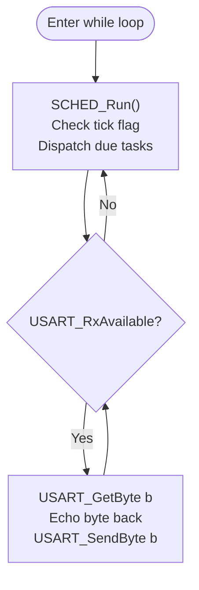

---

## 3. Cooperative Scheduler

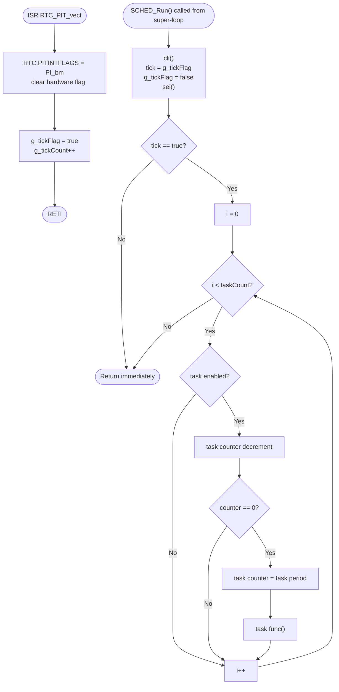

---

## 4. Control-Loop State Machine

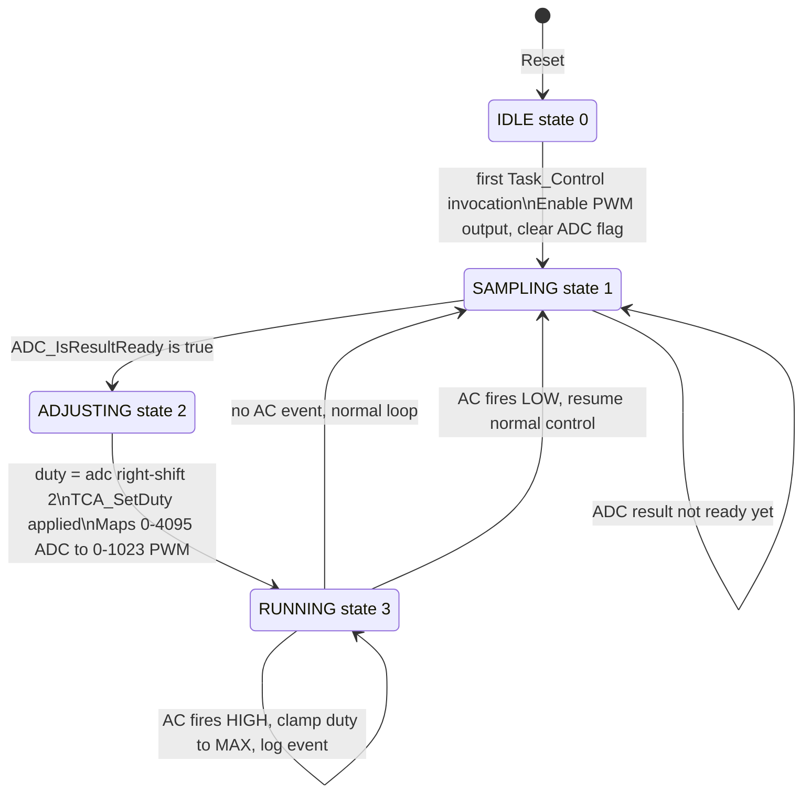

---

## 5. ADC Driver — Interrupt Flow

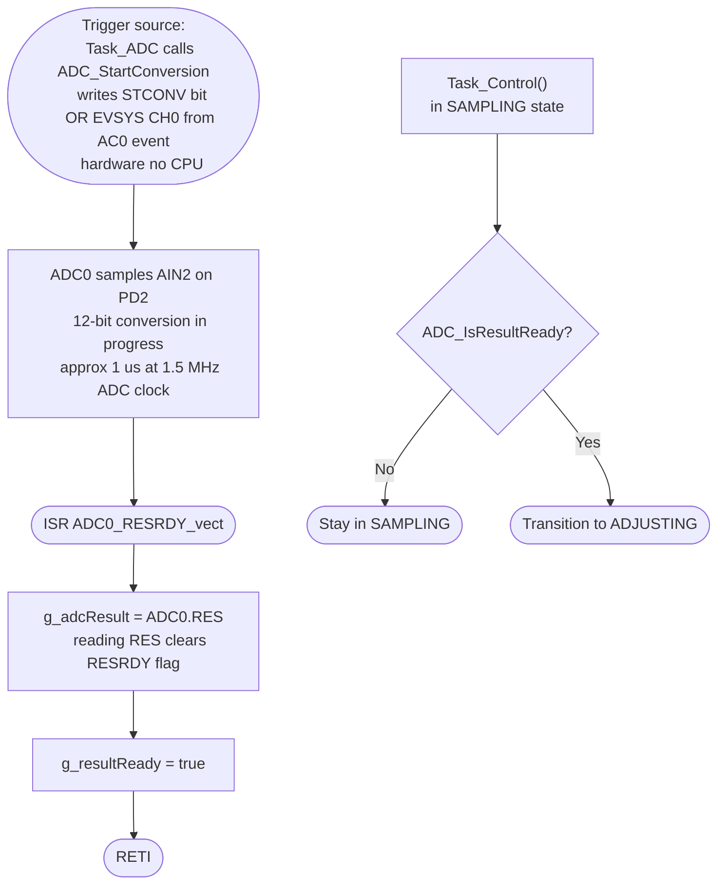

---

## 6. USART Driver — Interrupt Flow

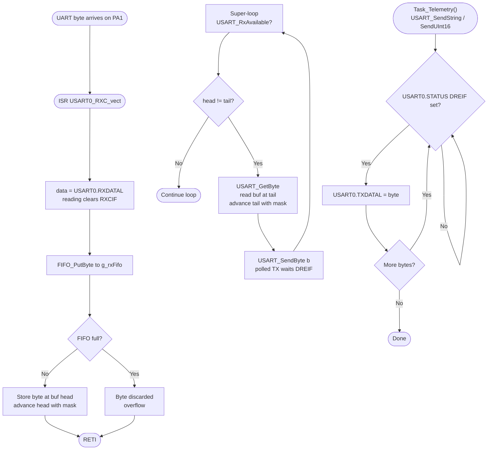

---

## 7. AC Driver — Interrupt Flow

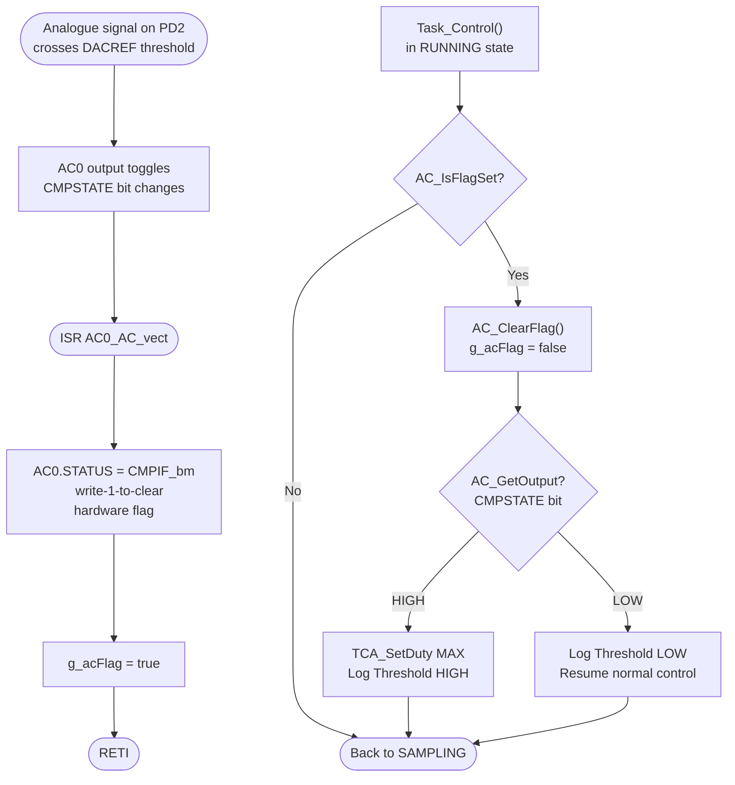

---

## 8. EVSYS Autonomous Event Path

```mermaid
flowchart LR
    AC0_OUT(["AC0 output edge
    CMPSTATE toggles"])
    CH0(["EVSYS CHANNEL0
    generator = AC0_OUT_gc"])
    ADC_START(["ADC0 START
    USERADC0START = 0x01"])
    CONV2(["ADC0 begins conversion
    automatic zero CPU latency"])
    ISR2(["ADC0_RESRDY_vect fires
    g_resultReady = true"])

    AC0_OUT -->|hardware event| CH0
    CH0     -->|channel routing| ADC_START
    ADC_START -->|EVCTRL.STARTEI| CONV2
    CONV2   -->|RESRDY interrupt| ISR2

    style AC0_OUT   fill:#f9a,stroke:#c00
    style CH0       fill:#adf,stroke:#06c
    style ADC_START fill:#adf,stroke:#06c
    style CONV2     fill:#afa,stroke:#060
    style ISR2      fill:#afa,stroke:#060
```

> This path operates entirely in hardware. The CPU is not involved until the RESRDY ISR fires after the conversion completes.

---

## 9. FIFO Ring Buffer — Put and Get

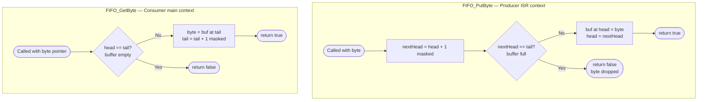

---

## 10. Task Timing Diagram

```mermaid
gantt
    title Scheduler Task Periods (relative to RTC PIT tick, approx 1 ms per unit)
    dateFormat X
    axisFormat %s

    section RTC PIT
    Tick 0               :milestone, m0, 0,   1
    Tick 51              :milestone, m1, 51,  52
    Tick 102             :milestone, m2, 102, 103
    Tick 512             :milestone, m3, 512, 513

    section Task_ADC 50 ms
    ADC Task             :active, t1, 0,   51
    ADC Task             :active, t2, 51,  102
    ADC Task             :active, t3, 102, 153

    section Task_Control 100 ms
    Control Task         :crit, c1, 0,   102
    Control Task         :crit, c2, 102, 204
    Control Task         :crit, c3, 204, 306

    section Task_Telemetry 500 ms
    Telemetry Task       :done, tl1, 0,   512
    Telemetry Task       :done, tl2, 512, 1024

    section Task_LED 500 ms
    LED Toggle           :done, l1, 0,   512
    LED Toggle           :done, l2, 512, 1024
```

---

## 11. Full Peripheral Interaction Map

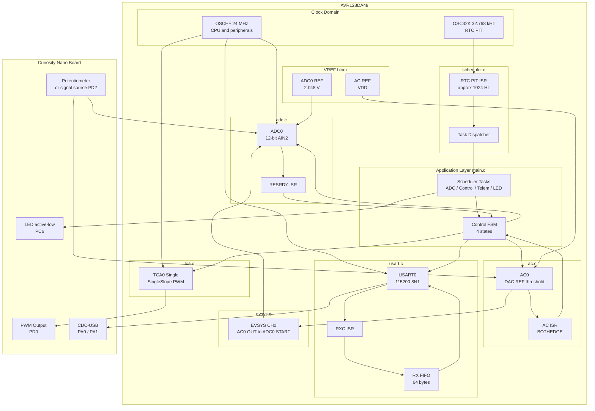
