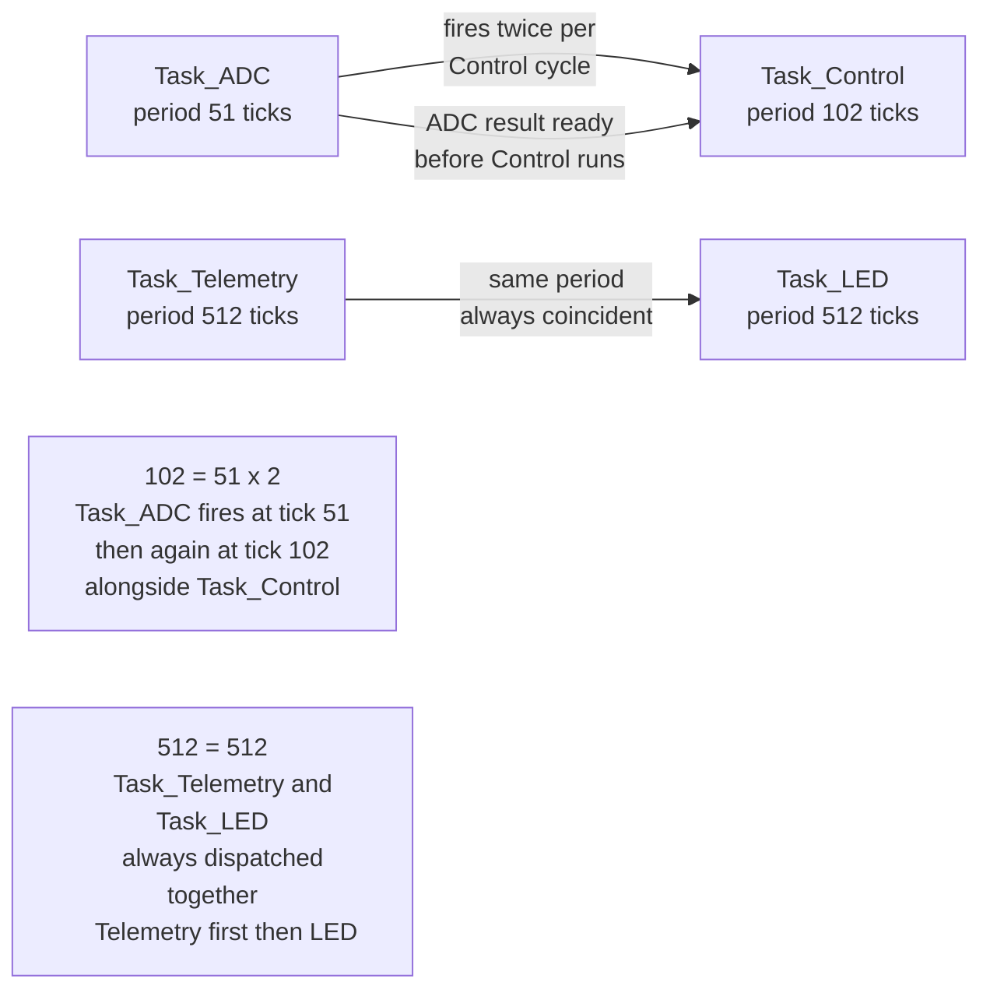

# Task Timing Diagram

This document shows the precise firing schedule of the four cooperative scheduler
tasks running on the AVR128DA48 PWM-Controlled Power Module firmware.

---

## How the Scheduler Works

The RTC Periodic Interrupt Timer (PIT) fires at **1024 Hz** (~0.977 ms per tick).
Each task is registered with a period (in ticks). On registration the counter is
pre-loaded to the full period value, so the **first firing occurs after one
complete period** has elapsed — no task fires at tick 0.

On every tick the dispatcher:
1. Decrements each enabled task's counter.
2. If the counter reaches **0**, calls the task function and reloads the counter.

Tasks that coincide on the same tick are dispatched **sequentially** in
registration order. Because every task is non-blocking and returns in
microseconds, this causes no timing problems in practice.

---

## Task Periods

| Task | Period (ticks) | Period (approx ms) | First fire (tick) |
|---|---|---|---|
| `Task_ADC` | 51 | ~49.8 ms | 51 |
| `Task_Control` | 102 | ~99.6 ms | 102 |
| `Task_Telemetry` | 512 | ~500 ms | 512 |
| `Task_LED` | 512 | ~500 ms | 512 |

---

## Coincident Firings (by design)

| Tick | Tasks firing together | Dispatch order |
|---|---|---|
| 102, 204, 306, 408, 510, 612, … | `Task_ADC` then `Task_Control` | ADC first (registered first) |
| 512, 1024, … | `Task_Telemetry` then `Task_LED` | Telemetry first (registered first) |

`Task_ADC` (period 51) fires exactly **twice** per `Task_Control` (period 102)
cycle, so every `Task_Control` firing is always paired with a `Task_ADC` firing
on the same tick. This is intentional: the ADC conversion triggered at tick 51
gives the result time to complete before `Task_Control` collects it at tick 102.

`Task_Telemetry` and `Task_LED` share the same period and start offset, so they
always fire together. Both are short (a string transmit and a pin toggle), so the
combined execution time is negligible.

---

## Timing Diagram — First 630 Ticks

Each bar represents one **waiting interval** ending at the dispatch (fire) tick.
The fire point is the right edge of each bar.

```mermaid
gantt
    title Cooperative Task Firing Schedule — First 630 Ticks (1 unit = 1 RTC PIT tick)
    dateFormat X
    axisFormat %s

    section Task_ADC (period 51)
    wait 1  :active, a1,  0,  51
    wait 2  :active, a2,  51, 102
    wait 3  :active, a3,  102, 153
    wait 4  :active, a4,  153, 204
    wait 5  :active, a5,  204, 255
    wait 6  :active, a6,  255, 306
    wait 7  :active, a7,  306, 357
    wait 8  :active, a8,  357, 408
    wait 9  :active, a9,  408, 459
    wait 10 :active, a10, 459, 510
    wait 11 :active, a11, 510, 561
    wait 12 :active, a12, 561, 612

    section Task_Control (period 102)
    wait 1  :crit, c1, 0,   102
    wait 2  :crit, c2, 102, 204
    wait 3  :crit, c3, 204, 306
    wait 4  :crit, c4, 306, 408
    wait 5  :crit, c5, 408, 510
    wait 6  :crit, c6, 510, 612

    section Task_Telemetry (period 512)
    wait 1  :done, tl1, 0,   512

    section Task_LED (period 512)
    wait 1  :done, l1, 0,   512
```

---

## Firing Event Markers — First 630 Ticks

The markers below show the exact tick at which each task is dispatched.
Markers that share a tick column indicate coincident firings dispatched
sequentially in the order shown.

```mermaid
gantt
    title Task Dispatch Events — First 630 Ticks (marker = fire tick)
    dateFormat X
    axisFormat %s

    section Task_ADC fires
    tick 51   :milestone, fa1,  51,  52
    tick 102  :milestone, fa2,  102, 103
    tick 153  :milestone, fa3,  153, 154
    tick 204  :milestone, fa4,  204, 205
    tick 255  :milestone, fa5,  255, 256
    tick 306  :milestone, fa6,  306, 307
    tick 357  :milestone, fa7,  357, 358
    tick 408  :milestone, fa8,  408, 409
    tick 459  :milestone, fa9,  459, 460
    tick 510  :milestone, fa10, 510, 511
    tick 561  :milestone, fa11, 561, 562
    tick 612  :milestone, fa12, 612, 613

    section Task_Control fires
    tick 102  :milestone, fc1, 102, 103
    tick 204  :milestone, fc2, 204, 205
    tick 306  :milestone, fc3, 306, 307
    tick 408  :milestone, fc4, 408, 409
    tick 510  :milestone, fc5, 510, 511
    tick 612  :milestone, fc6, 612, 613

    section Task_Telemetry fires
    tick 512  :milestone, ft1, 512, 513

    section Task_LED fires
    tick 512  :milestone, fl1, 512, 513
```

---

## Timing Diagram — Two Full Telemetry Cycles (1024 Ticks)

```mermaid
gantt
    title Two Full Telemetry Cycles — 1024 Ticks
    dateFormat X
    axisFormat %s

    section Task_ADC (period 51)
    Cycle 1-2   :active, a1,  0,   102
    Cycle 3-4   :active, a2,  102, 204
    Cycle 5-6   :active, a3,  204, 306
    Cycle 7-8   :active, a4,  306, 408
    Cycle 9-10  :active, a5,  408, 510
    Cycle 11-12 :active, a6,  510, 612
    Cycle 13-14 :active, a7,  612, 714
    Cycle 15-16 :active, a8,  714, 816
    Cycle 17-18 :active, a9,  816, 918
    Cycle 19-20 :active, a10, 918, 1020

    section Task_Control (period 102)
    Cycle 1  :crit, c1,  0,   102
    Cycle 2  :crit, c2,  102, 204
    Cycle 3  :crit, c3,  204, 306
    Cycle 4  :crit, c4,  306, 408
    Cycle 5  :crit, c5,  408, 510
    Cycle 6  :crit, c6,  510, 612
    Cycle 7  :crit, c7,  612, 714
    Cycle 8  :crit, c8,  714, 816
    Cycle 9  :crit, c9,  816, 918
    Cycle 10 :crit, c10, 918, 1020

    section Task_Telemetry (period 512)
    Cycle 1  :done, tl1, 0,   512
    Cycle 2  :done, tl2, 512, 1024

    section Task_LED (period 512)
    Cycle 1  :done, l1,  0,   512
    Cycle 2  :done, l2,  512, 1024
```

---

## Key Relationships

---

## Summary

- **`Task_ADC` fires at every odd multiple of 51**: 51, 102, 153, 204, …
- **`Task_Control` fires at every multiple of 102**: 102, 204, 306, 408, …
- Every `Task_Control` firing is **always preceded in the same tick** by a
  `Task_ADC` firing (because 102 is an exact multiple of 51). The ADC task
  runs first (registration order), triggering or checking a conversion; the
  control task runs immediately after in the same tick, collecting the result.
- **`Task_Telemetry` and `Task_LED`** share an identical period and start
  offset. They always fire on the same tick and are dispatched in registration
  order: Telemetry first, then LED.
- No task ever fires at **tick 0**. All counters are pre-loaded to the full
  period on registration.
