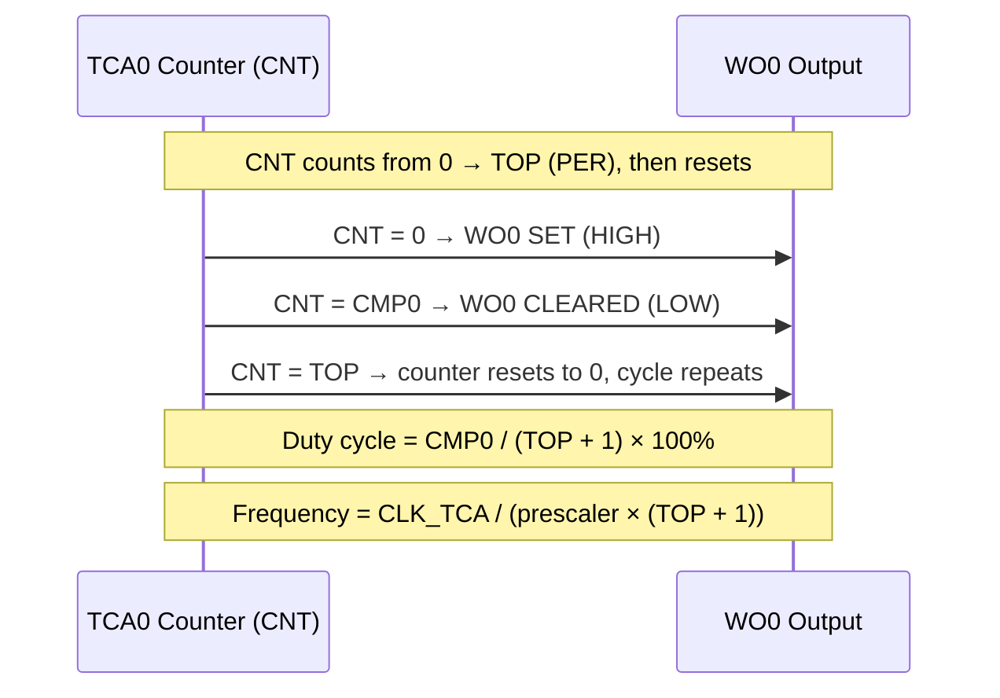
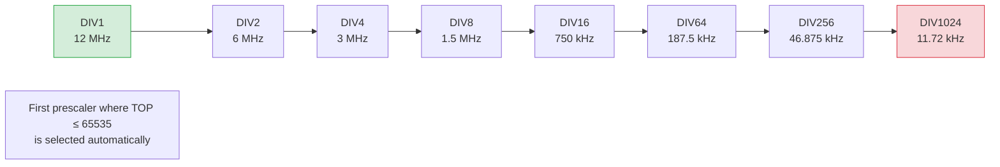

# Program Flowchart — AVR128DA48 TCA0 PWM

This diagram illustrates the full program flow of `main.c`, from startup through the runtime PWM demo loop.

```mermaid
flowchart TD
    A([Start / Power-On Reset]) --> B

    subgraph CLOCK ["Clock Initialization — clock_init_24mhz_presc2()"]
        B[CCP write: Select OSCHF as main clock source] --> C
        C[CCP write: Set OSCHF to 24 MHz] --> D
        D[CCP write: Enable prescaler ÷2 → CLK_PER = 12 MHz]
    end

    D --> E

    subgraph INIT ["TCA0 Initialization — tca0_pwm_init()"]
        E[Set PORTMUX.TCAROUTEA = PORTA default route] --> F
        F[Set WO0 pin as output — PORTA DIR] --> G
        G[Disable TCA0 — CTRLA = 0] --> H
        H[Set CTRLB: Single-Slope PWM mode, enable CMP0/WO0] --> I
        I[Reset CNT = 0, PER = 0xFFFF, CMP0 = 0] --> J
        J[Clear all interrupt flags]
    end

    J --> K

    subgraph SETINIT ["Initial PWM Output"]
        K[tca0_pwm_set — 20 kHz, 50% duty]
    end

    K --> L

    subgraph MAINLOOP ["Main Loop — while 1"]
        L([Loop Start]) --> M

        subgraph SWEEP ["Duty Cycle Sweep — 5 kHz"]
            M[d = 10] --> N
            N{d ≤ 90?} -->|Yes| O
            O[tca0_pwm_set — 5 kHz, d% duty] --> P
            P[Software delay ~200000 NOPs] --> Q
            Q[d += 10] --> N
            N -->|No| R
        end

        R[tca0_pwm_set — 1 kHz, 50% duty] --> S
        S[Software delay ~400000 NOPs] --> L
    end

    subgraph PRESCALER ["tca0_pwm_pick_prescaler — called inside tca0_pwm_set()"]
        T([Enter]) --> U
        U[i = 0, try DIV1] --> V
        V["Compute: tca_clk = CLK_PER / divider
TOP = tca_clk / freq_hz − 1"] --> W
        W{TOP fits in\n16 bits?} -->|Yes| X
        X[Return TOP and prescaler select bits] --> Y([Done])
        W -->|No| Z
        Z{More prescalers\navailable?} -->|Yes, try next| U
        Z -->|No| AA
        AA[Return failure — timer stopped, CMP0 = 0] --> Y
    end

    subgraph PWMSET ["tca0_pwm_set — runtime update"]
        AB([Enter]) --> AC
        AC[Clamp duty_percent to 0..100] --> AD
        AD[Call tca0_pwm_pick_prescaler] --> AE
        AE{Valid\nprescaler\nfound?} -->|No| AF
        AF[Stop TCA0, set PER = 0xFFFF, CMP0 = 0] --> AG([Return])
        AE -->|Yes| AH
        AH["Compute CMP0 = (TOP + 1) × duty% / 100"] --> AI
        AI[Stop TCA0 — CTRLA = 0] --> AJ
        AJ[Write PER = TOP] --> AK
        AK[Write CMP0] --> AL
        AL[Start TCA0: CTRLA = prescaler_sel | ENABLE] --> AG
    end
```

---

## Single-Slope PWM Signal Diagram



---

## Prescaler Selection Logic


